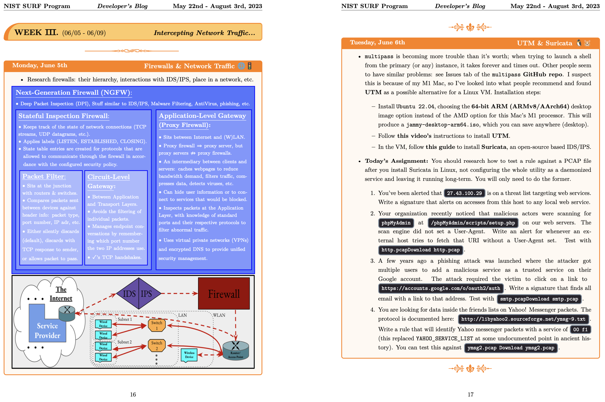

# This project's repository is currently private.

This is a daily blog for a project that is in the process of being published under the NIST software license.
It is currently in the repository [usnistgov/ngpac](https://github.com/usnistgov/ngpac), but will be forked to this profile soon.
Until then, a copy of its README.md file is found below.

[Read the blog HERE](https://github.com/Awildanthony/NIST_SURF_2023_Blog/blob/main/NGPaC_Blog.pdf)

# **P-Capyrus**
## ***Next Generation Policy-as-Code***

An easy-to-use prototype that parses English-language prompts detailing information and network security policy and translates them into series of packet-capture (PCAP) expressions as conjoined literals.

Built as a 2023 SURF Project at the National Institute of Standards and Technology (NIST), an agency of the federal government. It is a soon-to-be open-sourced project on GitHub with the goal of semi-automatically enforcing all cybersecurity policy pertaining to Layers 3 & 4 network traffic.

Currently a work in progress by [@Awildanthony](https://github.com/Awildanthony).

Documentation is being continually drafted alongside development of the web application, as well as additional support for the translation tool.
